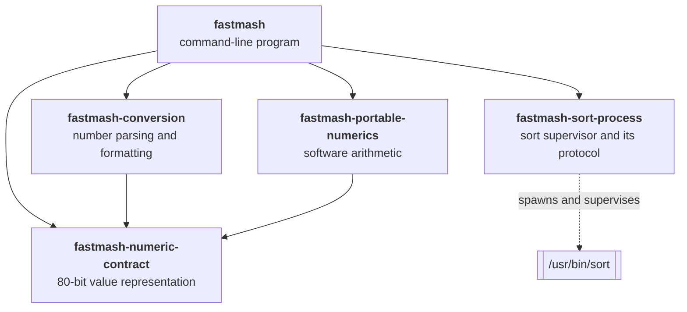
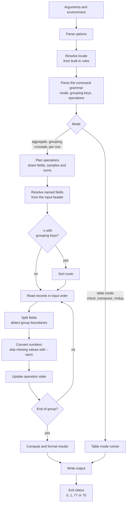
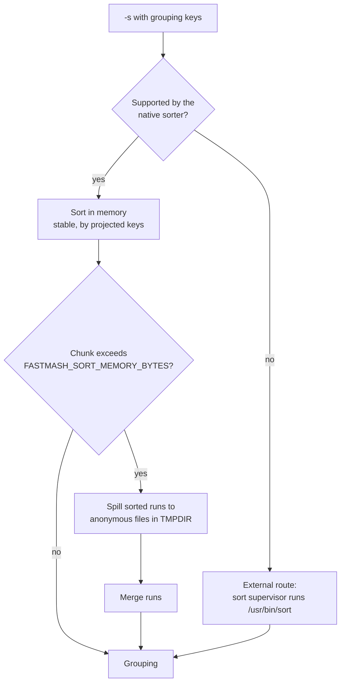
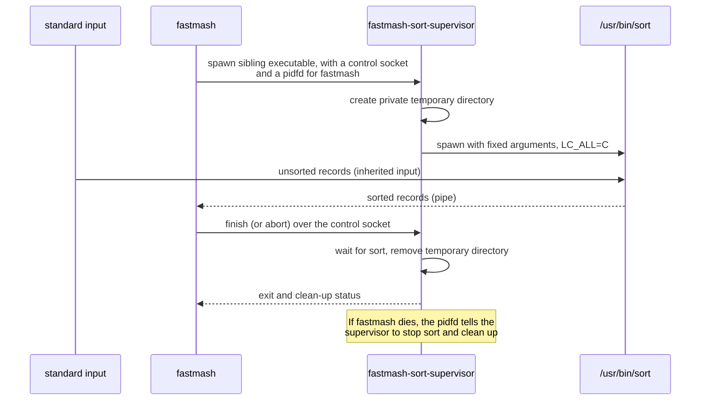

# Architecture

This document describes how Fastmash is built: what each part does, how a
command flows through it, and the principles behind the main design choices.
It is written for contributors and for anyone evaluating the project. The
[glossary](https://fastmash.io/contributing/glossary.html) defines the terms used here.

## At a glance

| | |
| --- | --- |
| Language | Rust (edition 2024), about 38,000 lines across five crates |
| Platform | Linux x86-64 with glibc; Windows through WSL2 |
| Interface | GNU datamash 1.9 command language: over 70 operations and modes |
| Numbers | 80-bit extended precision, implemented in software |
| Sorting | In-memory sort with disk spill; the system `sort` for some routes |
| Runtime dependencies | glibc, and `/usr/bin/sort` for the external sort route |
| Network access | None |

## Design principles

These choices shape the whole codebase. Each is recorded as a decision in
[decision records](https://fastmash.io/adr/).

1. **Speed is the reason to switch.** Fastmash exists because people run
   datamash in pipelines over large files. Performance work is measured on
   representative jobs against GNU datamash and against the previous Fastmash
   build. A change that makes an existing job materially slower needs an
   explicit, recorded justification.
2. **The datamash command language is the interface.** Existing commands,
   options and field selectors work unchanged. Fastmash reimplements the
   *behavior*; it contains no GNU code.
3. **Portable results.** One Fastmash version gives identical results on every
   supported machine for the same input and explicit settings. Arithmetic does not depend on the CPU's
   floating-point unit or on the C math library, so a result computed on a
   laptop matches the one computed in CI.
4. **Refuse rather than guess.** If Fastmash cannot produce a result it can
   stand behind (an unsupported feature or locale, a checked resource limit, or a
   numerical result it cannot produce within its fixed rules), it stops with a clear
   message and exit status 77 instead of printing something plausible.
5. **Grow as needed, and check.** There are no fixed caps on record length,
   operation count or sample count. Storage grows with the job, every
   allocation is checked, and sorting spills to disk. The few remaining fixed
   limits (such as the 99-byte `--format` string) are documented.

## Crates

<!-- description: The fastmash program depends on four library crates: fastmash-conversion, fastmash-portable-numerics, fastmash-numeric-contract and fastmash-sort-process. The conversion and portable-numerics crates build on fastmash-numeric-contract, and fastmash-sort-process spawns and supervises /usr/bin/sort. -->

| Crate | Path | Responsibility |
| --- | --- | --- |
| `fastmash` | `crates/cli` | The program: options, command grammar, records and fields, grouping, sorting, every operation, output and exit status |
| `fastmash-conversion` | `crates/conversion` | Reading numbers from bytes and printing them, missing-value detection, locale number conventions. No `unsafe` code |
| `fastmash-portable-numerics` | `crates/portable-numerics` | Software 80-bit arithmetic for the numerical rules, including fallback `log` and `exp` |
| `fastmash-numeric-contract` | `crates/numeric-contract` | The 80-bit extended-precision value type and its classification. `no_std`, no `unsafe` code, no dependencies |
| `fastmash-sort-process` | `crates/sort-process` | The `fastmash-sort-supervisor` executable and the protocol the program uses to control it |

## How a command runs

<!-- description: A command is parsed, its locale resolved and its command grammar parsed. Table modes (check, transpose, rmdup) go to the table mode runner. Other modes plan their operations, resolve named fields and, with -s and grouping keys, pass through the sort route. Records are then read, split into fields, converted and accumulated until each group ends, when results are computed and written. The program exits with status 0, 1, 77 or 70. -->

Some points worth knowing when reading the code:

- **Planning happens before input is read.** The whole command is parsed and
  validated first, so most usage errors appear before any output.
- **Operations share work.** When several operations read the same field, the
  conversion, running sums and retained samples are shared. `median`, `q1` and
  `q3` on one field sort one sample set, and the moment statistics share one
  pass over their inputs.
- **Groups are adjacent records.** Without `-s`, a group ends when its key
  changes, and state for the next group starts fresh. That is what makes
  unsorted grouping a single streaming pass.
- **Output is written progressively.** Completed groups go to a small output
  buffer that is flushed as it fills (line by line on a terminal). A failure part-way through can leave earlier rows written, which
  is why the exit status must always be checked.

## Sorting

`-s` sorts records by their grouping keys before grouping. Fastmash chooses a
**sort route** for each command:

<!-- description: With -s and grouping keys, jobs the native sorter supports are sorted in memory; chunks larger than FASTMASH_SORT_MEMORY_BYTES are spilled as sorted runs to anonymous files in TMPDIR and merged. Other jobs take the external route, where the sort supervisor runs /usr/bin/sort. Both routes feed grouping. -->

- The **native route** sorts in process. It covers counting and text
  operations, basic statistics, quantiles, modes, MAD and variance, and every
  operation in the language locales, whose text ordering comes from
  pinned Unicode ICU data built into the program rather than the host's locale files.
- **Spill** writes sorted runs to anonymous temporary files (`O_TMPFILE`, or
  where the filesystem lacks it a private file unlinked as soon as it is open),
  which the kernel removes automatically when Fastmash exits, however it exits.
- The **external route** remains, in the C locales, for `rand`, the other means
  (`geomean`, `harmmean`, `ms`, `rms`), skewness, kurtosis, normality tests,
  paired statistics and sorted `rmdup`. Its temporary files go in a private
  directory in `TMPDIR`, which the supervisor creates and removes.

### The sort supervisor

When the external route is used, Fastmash does not run `sort` directly. It
starts `fastmash-sort-supervisor`, which runs `sort` with a fixed argument list
in a private temporary directory and guarantees clean-up even if the main
program is killed.

<!-- description: fastmash spawns the sort supervisor with a control socket and a pidfd. The supervisor creates a private temporary directory and starts /usr/bin/sort with fixed arguments and LC_ALL=C. sort reads the unsorted records from standard input and sends sorted records to fastmash through a pipe. fastmash then tells the supervisor to finish or abort; the supervisor waits for sort, removes the directory and reports its status. If fastmash dies, the pidfd tells the supervisor to stop sort and clean up. -->

The control channel is a small fixed-format message protocol defined in
`crates/sort-process/src/lib.rs`. The supervisor uses Linux pidfds and
`close_range`, so this route needs Linux 5.11 or later.

## Numbers

Numerical behavior is where Fastmash differs most from a straightforward port.

- **Representation.** Values are 80-bit extended precision (64-bit
  significand), the same range and precision GNU datamash uses on x86-64, so
  results agree closely with it.
- **Software arithmetic.** Instead of the x87 floating-point unit and the C
  math library, Fastmash implements the arithmetic itself. This is what
  delivers *portable results*: the output does not depend on the CPU model, the
  compiler, or the libm version.
- **`log` and `exp`.** The geometric mean, the normality tests and similar
  statistics need transcendental functions. Fastmash aims for the correctly
  rounded 80-bit result: fast paths prove their result with a certificate and
  otherwise fall back to arbitrary-precision evaluation. A few boundary cases
  that cannot be settled within fixed limits are refused (status 77).
- **Ordered evaluation.** Sums are accumulated in input order and formulas
  follow the same order of operations as GNU datamash, because reordering
  floating-point arithmetic changes results.
- **Versioned numerical rules.** Parsing, arithmetic, special values,
  formatting and refusals are specified together as a numerical profile. Any
  change to observable numerical output is a deliberate, versioned change
  listed in the changelog.
- **Fast paths.** Common cases, such as decimal inputs that can be summed
  exactly, take specialized paths that give the same result faster.

## Errors and exit statuses

| Status | Meaning | Examples |
| --- | --- | --- |
| 0 | Success | |
| 1 | Error in the command or its input | Unknown option, non-numeric value, missing field, write failure |
| 77 | Refusal | Unsupported feature or locale, checked allocation failure, numerical capacity reached |
| 70 | Internal failure | A violated numerical invariant; please report it |

Diagnostics are written to standard error as `fastmash: message`, sometimes
followed by a `hint:` line suggesting a fix. If an error and a refusal both
occur, the refusal status wins. Other internal failures are reported with
status 77 (for example an internal conversion failure) or, since panics abort,
end the process with `SIGABRT`; all of them are bugs.

## Safety

- **`unsafe` code** is limited to operating-system interfaces (Linux system
  calls for standard streams, process supervision and temporary files), one
  fixed-size arena allocation in the numerics crate, and one x86-64 `div`
  instruction for 128-by-64-bit division in decimal parsing, guarded by an
  assertion of its precondition. (Test-only research code that exercises the
  x87 unit for comparisons is excluded from release builds.) The conversion
  and numeric-contract crates forbid `unsafe` entirely. Every other crate
  denies unsafe operations inside `unsafe fn` without an explicit block and
  warns on any `unsafe` block without a `// SAFETY:` comment, which CI treats
  as an error.
- **Overflow checks stay on** in release builds, and panics abort.
- **No network, no shell.** Fastmash never makes network connections and never
  passes input to a shell. The only child processes are the sort
  supervisor and the system `sort` it starts, with a fixed argument list.
- **Dependencies** are few and pinned. See [`Cargo.toml`](https://github.com/pederbe/fastmash/blob/main/crates/cli/Cargo.toml).

## Dependencies

| Dependency | Why |
| --- | --- |
| `rustc_apfloat` | Software IEEE arithmetic for 80-bit values |
| `astro-float` | Arbitrary-precision arithmetic for `log` and `exp` |
| `icu_collator`, `icu_locale_core` | Language-locale text ordering from pinned Unicode data |
| `memchr` | Fast byte searching for record and field splitting |
| `num-bigint`, `num-integer`, `num-traits` | Exact decimal conversion |
| `base64`, `md-5`, `sha1`, `sha2` | The `base64` and checksum operations |
| `libc` | The C entry point and signal setup |

## Where to start reading

| To understand | Start with |
| --- | --- |
| The overall flow | `crates/cli/src/main.rs` |
| Option parsing | `crates/cli/src/options.rs` |
| Operations, selectors and modes | `crates/cli/src/grammar.rs` |
| Records and field splitting | `crates/cli/src/records.rs` |
| Sorting and spill | `crates/cli/src/projected_sort.rs`, `projected_spill.rs` |
| A statistic, for example quantiles | `crates/cli/src/ordered_statistics.rs` |
| Output and exit status | `crates/cli/src/command_output.rs` |
| Number parsing and printing | `crates/conversion/src/` |
| Arithmetic | `crates/portable-numerics/src/lib.rs`, `crates/cli/src/numerics.rs` |
| `log` and `exp` | `crates/cli/src/mean_math.rs`, `guarded_log.rs`, `boundary_exp.rs` |

## Decision records

Architecture decisions are recorded in [decision records](https://fastmash.io/adr/). Read them
before proposing a change to one of the principles above.
