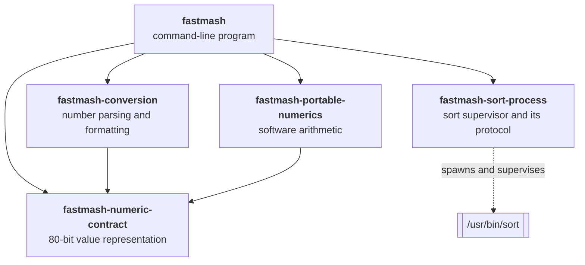
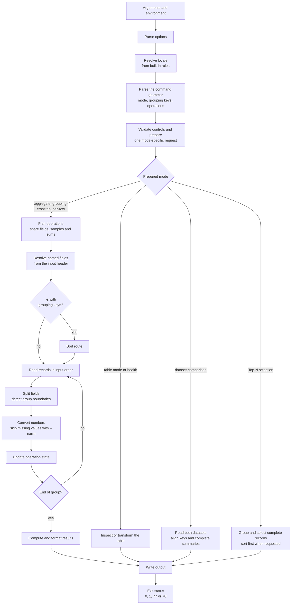
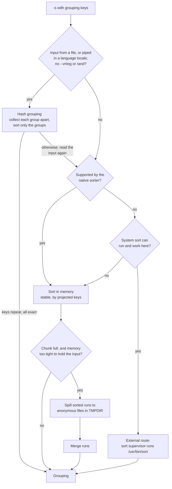
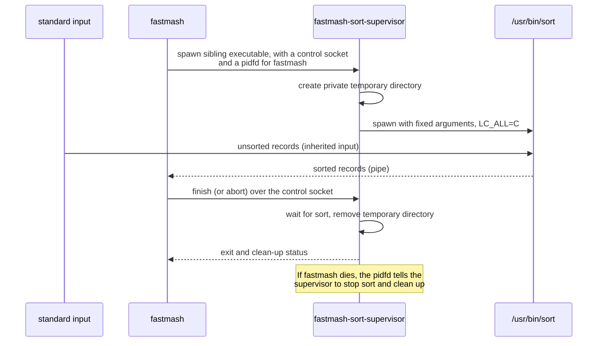

# Architecture

This document describes how Fastmash is built: what each part does, how a
command flows through it, and the principles behind the main design choices.
It is written for contributors and for anyone evaluating the project. The
[glossary](https://fastmash.io/contributing/glossary.html) defines the terms used here.

## At a glance

| | |
| --- | --- |
| Language | Rust (edition 2024), five product crates |
| Platform | Linux x86-64 with glibc; Windows through WSL2; native Apple Silicon macOS 15+ in the 0.2.0 candidate |
| Interface | GNU datamash 1.9 command language, with explicit CSV, health, selection, weighted mean and comparison extensions |
| Numbers | 80-bit extended precision, implemented in software |
| Sorting | In-memory sort with disk spill; the system `sort` for some routes |
| Runtime dependencies | glibc on Linux, and `/usr/bin/sort` for the Linux external sort route; system libraries on macOS |
| Network access | None |

## Design principles

The published 0.1.0 artifacts remain Linux-only. Native macOS candidate
uses the built-in Sort route and private unlinked Spill storage, without a
Sort supervisor. [ADR 0010: Native Apple Silicon macOS](https://fastmash.io/adr/0010-native-apple-silicon.html)
sets its platform scope and the native artifact acceptance boundary.

These choices shape the whole codebase. Each is recorded as a decision in
[decision records](https://fastmash.io/adr/).

1. **Speed is the reason to switch.** Fastmash exists because people run
   datamash in pipelines over large files. Performance work is measured on
   representative jobs against GNU datamash and against the previous Fastmash
   build. A change that makes an existing job materially slower needs an
   explicit, recorded justification.
2. **The datamash command language is the interface.** Existing commands,
   options and field selectors work unchanged. Fastmash reimplements the
   *behavior*; it contains no GNU code.
3. **Portable results.** One Fastmash version gives identical results on every
   supported machine for the same input and explicit settings. Arithmetic does not depend on the CPU's
   floating-point unit or on the C math library, so a result computed on a
   laptop matches the one computed in CI.
4. **Refuse rather than guess.** If Fastmash cannot produce a result it can
   stand behind (an unsupported feature or locale, a checked resource limit, or a
   numerical result it cannot produce within its fixed rules), it stops with a clear
   message and exit status 77 instead of printing something plausible.
5. **Grow as needed, and check.** There are no fixed caps on record length,
   operation count or sample count. Storage grows with the job, every
   allocation is checked, and sorting spills to disk. The few remaining fixed
   limits (such as the 99-byte `--format` string) are documented.

## Crates

<!-- description: The fastmash program depends on four library crates: fastmash-conversion, fastmash-portable-numerics, fastmash-numeric-contract and fastmash-sort-process. The conversion and portable-numerics crates build on fastmash-numeric-contract, and fastmash-sort-process spawns and supervises /usr/bin/sort. -->

| Crate | Path | Responsibility |
| --- | --- | --- |
| `fastmash` | `crates/cli` | The program: options, command grammar, records and fields, grouping, sorting, every operation, output and exit status |
| `fastmash-conversion` | `crates/conversion` | Reading numbers from bytes and printing them, missing-value detection, locale number conventions. No `unsafe` code |
| `fastmash-portable-numerics` | `crates/portable-numerics` | Software 80-bit arithmetic for the numerical rules, including fallback `log` and `exp` |
| `fastmash-numeric-contract` | `crates/numeric-contract` | The 80-bit extended-precision value type and its classification. `no_std`, no `unsafe` code, no dependencies |
| `fastmash-sort-process` | `crates/sort-process` | The `fastmash-sort-supervisor` executable and the protocol the program uses to control it |

## How a command runs

<!-- description: Options, locale and grammar are resolved before validation prepares one mode-specific request. Table modes and health inspect or transform a table. Dataset comparison reads both datasets, aligns keys and finishes all summaries before output. Top-N selection groups and selects complete records, sorting first when requested. Ordinary calculations plan shared operations and named fields, prepare sorted groups when needed, then read, convert and accumulate records until each group ends. Output is written and the program exits with status 0, 1, 77 or 70. -->

Some points worth knowing when reading the code:

- **Planning happens before input is read.** The whole command is parsed and
  validated first, so most usage errors appear before any output. The preparation
  module (`preparation.rs`) checks control conflicts, selectors, result names and
  sorting eligibility in their required order, then returns one prepared request
  for the selected mode. Private payloads keep runners from receiving an
  unprepared request. Input headers, numerical admission and resource checks still
  happen at their existing execution points; preparation does not open inputs.
- **Operations share work.** When several operations read the same field, the
  conversion, running sums and retained samples are shared. `median`, `q1` and
  `q3` on one field sort one sample set, and the moment statistics share one
  pass over their inputs. The operation set (`operation_set.rs`) plans this
  sharing once the fields are known, reports what the command needs before
  input is read, and collects records, resets between groups and writes
  results.
- **Groups are adjacent records.** Without `-s`, a group ends when its key
  changes, and state for the next group starts fresh. That is what makes
  unsorted grouping a single streaming pass.
- **Ordinary results are written progressively.** Completed groups go to a small output
  buffer that is flushed as it fills (line by line on a terminal). A failure part-way through can leave earlier rows written, which
  is why the exit status must always be checked.
- **Formats keep field boundaries.** Ordinary text uses its separator rules.
  Explicit CSV decodes logical records and retains complete fields and original
  logical-record/physical-line locations; output encodes each field separately.
  Record views let calculations borrow shared storage, while retained full rows
  and admitted selection candidates own what must outlive that view.
- **Comparison and health finish before reporting.** Dataset comparison keeps
  complete keys, per-key operation state and required samples, preserving each
  key's contribution order across each source. It finishes both scans and all
  changes before writing. Health collects field and width counters and bounded
  examples before emitting a readable or versioned TSV report. Neither adds
  spill for retained samples or a total-memory guarantee.

## Sorting

`-s` sorts records by their grouping keys before grouping. Fastmash chooses a
**sort route** for each command before it reads input (`sort_route.rs`: `plan`,
then `run`): whether hash grouping comes first, and which sort follows it. The
external route's startup checks run then, with the others, so the
sort after hash grouping is known before hash grouping starts:

<!-- description: With -s and grouping keys, jobs whose input comes from a file, or from a pipe in a language locale (without --vnlog or rand), are grouped by hash first: each group's records are collected apart and only the groups are sorted; where that is not exact or pays too little, the input is read again and sorted by the route the job would otherwise take. Jobs the native sorter supports are sorted in memory; a full chunk that memory does not allow to hold the rest of the input is spilled as a sorted run to anonymous files in TMPDIR, and the runs are merged. Other jobs take the external route, where the sort supervisor runs /usr/bin/sort, if the system sort can run and work there; otherwise they are sorted in memory too. Both routes feed grouping. -->

- **Hash grouping** comes first, before the choice between the native and
  the external route, when standard input is a regular file
  (`projected_hash.rs`). GNU datamash sorts
  with a stable `sort -s`, so each of its groups is exactly the records with
  one key tuple, in input order. Hash grouping collects each tuple's records into that
  group's own operation state as they arrive, keeping every group's state in
  one flat array (the operation set's plans are shared; each group has only
  its running values, plus a separate store for operations that keep values),
  then sorts only the tuples, in the sort's order, and writes the groups
  through the same writer. It gives up before writing anything when the
  result might differ from the sort's (a missing or NUL key, a key the
  collation refuses, any operation error), when the groups are estimated to
  hold fewer than eight records each or, while records of a group rarely come
  together, to hold more state than the processor's caches (16 MiB), or when
  they outgrow the sort's memory target. The estimate is judged after 8,192
  records and at each doubling: the file's records from its length, and its
  groups from those seen once and twice (the Chao1 estimate of the groups not
  yet seen, of which the rest of the file is expected to show a share). When
  it gives up, the input is read again from its start, header included,
  through the route the job would otherwise take. Piped input can be read
  again only if it was kept: in a language locale, whose sort holds whole
  records anyway, a replay reader holds what hash grouping reads in 1 MiB
  blocks charged to the same memory budget, and the native sort reads them
  back, releasing each, and then the rest of the pipe; its chunk leaves room
  for what is still held. A pipe has no length, so the rest of it is taken to
  be as long as what was read. In the `C` locales piped input sorts, because
  the held input would take several times the memory of a sort that keeps
  only the selected fields (`FASTMASH_PIPE_GROUPING` changes either). With
  `-W`, whose sort keys keep the blanks before each field that groups ignore,
  a group is keyed by its fields with those blanks, as the sort compares
  them, and hash grouping gives up where two keys differ only in the blanks,
  or where a `-z` record holds a newline. `--vnlog` and `rand` (one generator
  across all groups) always sort.
- The **native route** sorts in process. It covers counting and text
  operations, basic statistics, quantiles, modes, MAD and variance, and every
  operation in the language locales, whose text ordering comes from
  pinned Unicode ICU data built into the program rather than the host's locale files.
  A language sort key (`locale.rs`) is the ICU collation key, at three
  levels, of the text with the characters glibc ignores (punctuation, most
  symbols and spaces, from glibc's iso14651_t1_common in `collation_glibc.rs`)
  left out and those some locales weigh first replaced by the lowest weight,
  followed by glibc's fourth level, written so that its bytes compare as
  glibc compares it item by item: the ranks of the ignored characters and
  the weighted characters between them, each after the count of letters
  without a fourth-level weight (Han, letters a locale adds) skipped before
  it, with runs of weighted characters written as counts.
- A **chunk** holds the records being sorted in one arena (each record's
  grouping keys, then the fields its operations use, or the whole record with
  `--full`, in the language locales, or for numbers when the field separator
  could continue one, since a number is read on from its field's start into
  the rest of the record as GNU datamash reads it) and a
  16-byte entry per record: the first key's eight-byte prefix, the key length
  and the arena offset. A stable radix sort orders the entries by prefix.
  Records whose prefixes tie on longer keys are sorted the same way by their
  next eight key bytes, round by round; complete keys are compared only in
  small groups and after 64 bytes of a key. Ties keep input order. In the
  language locales, collation keys are computed in batches on several
  threads. The chunk, with the batches' share, stays within its memory target:
  64 MiB at first. When a chunk fills, it may grow instead of
  spilling: to hold the whole input of a regular file (an estimate from the
  bytes read so far, at most the buffer GNU `sort` would use for the file), or
  to twice its size for piped input, when the memory read at that moment
  allows it. The chunk may take at most a quarter of the available memory, a
  share per processor of what is free under each cgroup memory limit (so that
  as many jobs as processors fit together), a share per running Fastmash of
  the host's available memory, and half of any address-space limit, and only
  while less than half the swap is in use. A fact that cannot be read keeps
  the chunk as it is. `FASTMASH_SORT_MEMORY_BYTES` fixes the target instead.
  The last chunk is read in place, without copying records; earlier chunks
  are spilled and merged with it.
- **Spill** writes sorted runs to anonymous temporary files (`O_TMPFILE`, or
  where the filesystem lacks it a private file unlinked as soon as it is open),
  which the kernel removes automatically when Fastmash exits, however it exits.
- **Quoted CSV sorting** uses its own complete decoded-record route, without
  hash replay or a text-format fallback. Record bytes, field ends, original
  locations and required language comparison segments are packed into shared
  chunks. Calculations borrow each chunk through group completion, and selection
  owns records only when they enter its candidates. Actual capacities and reusable
  decoder/key scratch count against the ordinary sort-memory policy. Checked
  private spill framing preserves complete ragged fields and locations; bounded
  merge heads remain owned. An oversized record and merge heads can exceed the
  chunk target, and statistical samples retain their separate in-memory policy.
- The **external route** remains, in the C locales, for `rand`, the other means
  (`geomean`, `harmmean`, `ms`, `rms`), skewness, kurtosis, normality tests,
  paired statistics and sorted `rmdup`. Its temporary files go in a private
  directory in `TMPDIR`, which the supervisor creates and removes. Where it
  cannot run or work (the conditions are in `sort_route::sort`,
  `sorted_input::available` and `fastmash_sort_process::available`), these
  jobs take the native route.

### The sort supervisor

When the external route is used, Fastmash does not run `sort` directly. It
starts `fastmash-sort-supervisor`, which runs `sort` with a fixed argument list
in a private temporary directory and guarantees clean-up even if the main
program is killed.

<!-- description: fastmash spawns the sort supervisor with a control socket and a pidfd. The supervisor creates a private temporary directory and starts /usr/bin/sort with fixed arguments and LC_ALL=C. sort reads the unsorted records from standard input and sends sorted records to fastmash through a pipe. fastmash then tells the supervisor to finish or abort; the supervisor waits for sort, removes the directory and reports its status. If fastmash dies, the pidfd tells the supervisor to stop sort and clean up. -->

The control channel is a small fixed-format message protocol defined in
`crates/sort-process/src/lib.rs`. The supervisor uses Linux pidfds and
`close_range`, so this route needs Linux 5.11 or later.

## Numbers

Numerical behavior is where Fastmash differs most from a straightforward port.

- **Representation.** Values are 80-bit extended precision (64-bit
  significand), the same range and precision GNU datamash uses on x86-64, so
  results agree closely with it.
- **Software arithmetic.** Instead of the x87 floating-point unit and the C
  math library, Fastmash implements the arithmetic itself. This is what
  delivers *portable results*: the output does not depend on the CPU model, the
  compiler, or the libm version.
- **`log` and `exp`.** The geometric mean, the normality tests and similar
  statistics need transcendental functions. Fastmash aims for the correctly
  rounded 80-bit result: fast paths prove their result with a certificate and
  otherwise fall back to arbitrary-precision evaluation. A few boundary cases
  that cannot be settled within fixed limits are refused (status 77).
- **Ordered evaluation.** Sums are accumulated in input order and formulas
  follow the same order of operations as GNU datamash, because reordering
  floating-point arithmetic changes results.
- **Versioned numerical rules.** Parsing, arithmetic, special values,
  formatting and refusals are specified together as a numerical profile. Any
  change to observable numerical output is a deliberate, versioned change
  listed in the changelog.
- **Fast paths.** Common cases, such as decimal inputs that can be summed
  exactly, take specialized paths that give the same result faster.

## Errors and exit statuses

| Status | Meaning | Examples |
| --- | --- | --- |
| 0 | Success | |
| 1 | Error in the command or its input | Unknown option, non-numeric value, missing field, write failure |
| 77 | Refusal | Unsupported feature or locale, checked allocation failure, numerical capacity reached |
| 70 | Internal failure | A violated numerical invariant or a failed numerical table identity check; please report it |

Diagnostics are written to standard error as `fastmash: message`, sometimes
followed by a `hint:` line suggesting a fix. When one failure follows another
(for example a failed write of the output after an error), the more serious
status wins: 70 over 77 over 1 (`failure::combine`). A diagnostic that cannot
be written makes the status 1. Other internal failures are reported with
status 77 (for example an internal conversion failure) or, since panics abort,
end the process with `SIGABRT`; all of them are bugs.

## Safety

- **`unsafe` code** is limited to operating-system interfaces (Linux system
  calls for standard streams, process supervision and temporary files), one
  fixed-size arena allocation in the numerics crate, one x86-64 `div`
  instruction for 128-by-64-bit division in decimal parsing, guarded by an
  assertion of its precondition, an x86-64 cache prefetch hint when a sorted
  chunk is read, which never dereferences its address, a glibc `mallopt` call
  at startup that caps malloc arenas under an address-space limit, and
  unchecked slicing of a sort run file's read buffer, whose bounds are kept
  as a documented invariant (checked slicing cost 4% on a spilling job). The
  conversion and numeric-contract crates forbid `unsafe` entirely. Every other crate
  denies unsafe operations inside `unsafe fn` without an explicit block and
  warns on any `unsafe` block without a `// SAFETY:` comment, which CI treats
  as an error.
- **Overflow checks stay on** in release builds, and panics abort.
- **No network, no shell.** Fastmash never makes network connections and never
  passes input to a shell. The only child processes are the sort
  supervisor and the system `sort` it starts, with a fixed argument list.
- **Dependencies** are few and pinned. See [`Cargo.toml`](https://github.com/pederbe/fastmash/blob/main/crates/cli/Cargo.toml).

## Dependencies

| Dependency | Why |
| --- | --- |
| `rustc_apfloat` | Software IEEE arithmetic for 80-bit values |
| `astro-float-num` | Arbitrary-precision arithmetic for `log` and `exp` |
| `icu_collator`, `icu_locale_core` | Language-locale text ordering from pinned Unicode data |
| `memchr` | Fast byte searching for record and field splitting |
| `num-bigint`, `num-integer`, `num-traits` | Exact decimal conversion |
| `base64`, `md-5`, `sha1`, `sha2` | The `base64` and checksum operations |
| `libc` | The C entry point and signal setup |

## Where to start reading

| To understand | Start with |
| --- | --- |
| The overall flow | `crates/cli/src/main.rs` |
| Option parsing | `crates/cli/src/options.rs` |
| The operations: names, spellings, what each needs and shares | `crates/cli/src/operation.rs` |
| Command syntax: operations, selectors and modes | `crates/cli/src/grammar.rs` |
| Planning and shared work of a command's operations | `crates/cli/src/operation_set.rs` |
| Binding named fields and grouping keys to the Input header | `crates/cli/src/binding.rs` |
| Reading records: comments, vnlog, the input header, read errors | `crates/cli/src/intake.rs` |
| Records and field splitting | `crates/cli/src/records.rs` |
| The sort route | `crates/cli/src/sort_route.rs`, `sorted_input.rs` (the system sort) |
| Hash grouping, and holding piped input to read it again | `crates/cli/src/projected_hash.rs`, `replay.rs` |
| Sorting and spill | `crates/cli/src/projected_sort.rs`, `projected_spill.rs` |
| A statistic, for example quantiles | `crates/cli/src/ordered_statistics.rs` |
| Output and exit status | `crates/cli/src/command_output.rs`, `buffered_stdout.rs`, `failure.rs` |
| Number parsing and printing | `crates/conversion/src/`; numeric fields: `crates/cli/src/decimal.rs` |
| Arithmetic | `crates/portable-numerics/src/lib.rs`, `crates/cli/src/numerics.rs` |
| `log` and `exp` | `crates/cli/src/mean_math.rs`, `guarded_log.rs`, `boundary_exp.rs` |

## Decision records

Architecture decisions are recorded in [decision records](https://fastmash.io/adr/). Read them
before proposing a change to one of the principles above.
