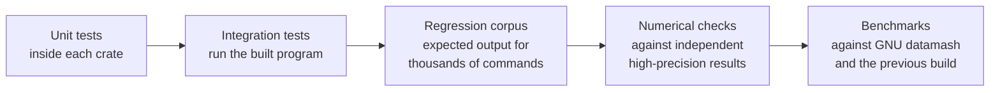

# Testing

Fastmash's job is to give the same answers as GNU datamash, faster, and to give
them identically on every supported machine. Testing is organized around those
three claims: **correctness**, **compatibility** and **performance**.


<!-- description: Testing layers, from narrowest to broadest: unit tests inside each crate, integration tests that run the built program, the regression corpus of expected output for thousands of commands, numerical checks against independent high-precision results, and benchmarks against GNU datamash and the previous build. -->

## Quick start

All commands run from the repository root on Linux x86-64 or WSL2.

```sh
cargo fmt --all --check                  # formatting
cargo clippy --workspace --all-targets -- -D warnings   # lints
cargo test --workspace                   # unit and integration tests
cargo build --release                    # the binaries the corpus runs
python3 scripts/check_regressions.py --binary target/release/fastmash
python3 scripts/check_regressions.py --binary target/release/fastmash --stdin-file
```

CI runs only when started manually, to preserve the limited Actions minutes.
A change is ready for review when all of these checks pass locally.

## Layers

### Unit tests

Each crate carries unit tests next to the code they test. Together with the
integration tests there are more than 400 test functions, many of them
table-driven over hundreds of inputs. They cover option and grammar parsing, record splitting, every
operation's edge cases (empty groups, NaN, signed zero, infinities, overflow),
number parsing and formatting, and the arithmetic primitives.

```sh
cargo test -p fastmash-portable-numerics   # one crate
cargo test -p fastmash grammar             # tests whose names match "grammar"
```

### Integration tests

`crates/cli/tests/` runs the compiled `fastmash` binary as a user would:
arguments, standard input, standard output, standard error and exit status.
Each file covers one area, such as grouping, selectors, quantiles, record
separators or pipeline failures (closed pipes, unreadable input, full disks).

When you fix a bug, add an integration test that reproduces it.

### Regression corpus

The regression corpus is a set of more than 3,000 commands, each with its
exact expected standard output, standard error and exit status. Expected
results for compatible behavior were observed from GNU datamash 1.9, running
each case twice, on the reference hosts. Cases where Fastmash intentionally
differs record Fastmash's documented behavior instead; the
[differences page](https://fastmash.io/guide/differences.html) gives the
reasons.

```sh
cargo build --release   # fastmash and fastmash-sort-supervisor, side by side
python3 scripts/check_regressions.py --binary target/release/fastmash --keep-going
python3 scripts/check_regressions.py --help
```

A run stops at the first mismatch and prints the case, the expected bytes and
the actual bytes. The cases give their input through a pipe; `--stdin-file` runs
those with ordinary input again with standard input as a regular file, against the same
expectations. Both modes need coverage: hash grouping applies to eligible files
and to eligible piped input in language locales, with different replay paths.

### Compatibility cases

A change that affects observable behavior (output, a diagnostic, an exit
status) needs a matching expectation. For behavior that should match GNU
datamash, compare against a real `datamash` 1.9 and record what it does. For
an intended difference, update
[Differences from GNU datamash](https://fastmash.io/guide/differences.html)
in the same pull request.

### Numerical checks

Fastmash promises identical numerical results across machines, so
arithmetic changes get extra scrutiny:

- Arithmetic primitives are tested against independently computed,
  high-precision reference values.
- `log` and `exp` results are checked against an independent
  arbitrary-precision library (MPFR), with emphasis on inputs whose results lie
  close to a rounding boundary.
- Numerical rules are versioned together. A change to any numerical output
  is deliberate, reviewed and listed in the changelog, never silent.

### Benchmarks

Performance claims come from **representative jobs**: real and synthetic
datasets with the commands people run on them, grouped into **job families**
such as decimal sums, quantiles and grouped text. Each job is timed for GNU
datamash 1.9, the previous Fastmash build and the candidate, on the same host,
alternating runs to reduce noise.

A performance change is accepted when it is faster on its target jobs and no
existing job becomes materially slower (the **predecessor guards**). See the
[benchmark method](https://fastmash.io/benchmarks/method.html) for datasets,
margins and hardware.

## Supported test environment

| | |
| --- | --- |
| OS | Linux x86-64 with glibc, or WSL2 |
| Kernel | 5.11 or later, for the external sort route |
| Tools | Stable Rust (see `rust-version` in `Cargo.toml`), Python 3.10 or later, GNU or uutils coreutils `sort` |
| Temporary storage | A writable `TMPDIR`, such as ext4 or tmpfs |

Under WSL, keep the checkout and `TMPDIR` on the Linux filesystem rather than a
Windows drive: tests are much faster there.

## Continuous integration

| Workflow | When | What |
| --- | --- | --- |
| `ci.yml` | Manual dispatch | Format, Clippy, tests, regression corpus on Ubuntu |
| `docs.yml` | Manual dispatch | Builds the website and checks links |
| `release.yml` | Manual dispatch on a version tag | Builds, tests and publishes release binaries |
