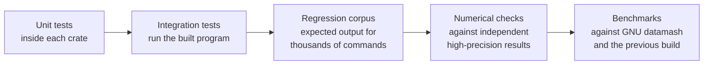

# Testing

Fastmash's job is to give the same answers as GNU datamash, faster, and to give
them identically on every supported machine. Testing is organized around those
three claims: **correctness**, **compatibility** and **performance**.


<!-- description: Testing layers, from narrowest to broadest: unit tests inside each crate, integration tests that run the built program, the regression corpus of expected output for thousands of commands, numerical checks against independent high-precision results, and benchmarks against GNU datamash and the previous build. -->

## Quick start

All commands run from the repository root on Linux x86-64 or WSL2. The native
Apple Silicon development gate described below runs on macOS 15 and 26.

```sh
cargo fmt --all --check                  # formatting
cargo clippy --workspace --all-targets -- -D warnings   # lints
cargo test --release --workspace         # unit and integration tests
cargo build --release                    # the binaries the corpus runs
python3 scripts/check_regressions.py --binary target/release/fastmash
python3 scripts/check_regressions.py --binary target/release/fastmash --stdin-file
```

Run the full suite with `--release`: memory-limit tests exercise the optimized
CLI. Debug builds can exceed those limits before reaching the behavior under test.
Installer tests exercise both Linux and macOS archive layouts, so Linux test
environments also need `shasum` on `PATH`. On Arch-based systems, it is supplied
at `/usr/bin/core_perl/shasum`; add that directory to the test environment's
`PATH` if needed.
A change is ready for review when all of these checks pass locally. CI also runs
on pushes and pull requests against `main` once the repository is public;
private automatic runs skip their jobs, while manual runs remain available.

## Layers

### Unit tests

Each crate carries unit tests next to the code they test. Together with the
integration tests there are more than 400 test functions, many of them
table-driven over hundreds of inputs. They cover option and grammar parsing, record splitting, every
operation's edge cases (empty groups, NaN, signed zero, infinities, overflow),
number parsing and formatting, and the arithmetic primitives.

```sh
cargo test -p fastmash-portable-numerics   # one crate
cargo test -p fastmash grammar             # tests whose names match "grammar"
```

### Integration tests

`crates/cli/tests/` runs the compiled `fastmash` binary as a user would:
arguments, standard input, standard output, standard error and exit status.
Each file covers one area, such as grouping, selectors, quantiles, record
separators or pipeline failures (closed pipes, unreadable input, full disks).

Native tests use the same command boundary. `native_streams.rs` covers inherited
descriptors and signals, terminal buffering and output faults; `native_sort.rs`
covers stable sorting, quoted CSV, complete records, selection, weighted
calculations, hash restart, piped replay, supported locales and forced spill.
Its interruption checks wait until a private run has been opened and unlinked
before sending a signal, then check temporary-storage cleanup. The ordinary CLI
suites still cover all operation families and the table-health, CSV, selection,
comparison and presentation extensions.

When you fix a bug, add an integration test that reproduces it.

### Regression corpus

The regression corpus is a set of more than 3,000 commands, each with its
exact expected standard output, standard error and exit status. Expected
results for compatible behavior were observed from GNU datamash 1.9, running
each case twice, on the reference hosts. Cases where Fastmash intentionally
differs record Fastmash's documented behavior instead; the
[differences page](https://fastmash.io/guide/differences.html) gives the
reasons.

```sh
cargo build --release   # fastmash and fastmash-sort-supervisor, side by side
python3 scripts/check_regressions.py --binary target/release/fastmash --keep-going
python3 scripts/check_regressions.py --help
```

A run stops at the first mismatch and prints the case, the expected bytes and
the actual bytes. The cases give their input through a pipe; `--stdin-file` runs
those with ordinary input again with standard input as a regular file, against the same
expectations. Both modes need coverage: hash grouping applies to eligible files
and to eligible piped input in language locales, with different replay paths.
The frozen fixture and its provenance record stay byte-identical across platforms.
On macOS, the runner requires no supervisor and uses the native fault transports
below. `--evidence-dir` retains the executable and fixture hashes, per-case
dispositions, native observations and mismatches. Regular-file mode records the
transport cases it leaves to the piped run, instead of silently excluding them.

### Compatibility cases

A change that affects observable behavior (output, a diagnostic, an exit
status) needs a matching expectation. For behavior that should match GNU
datamash, compare against a real `datamash` 1.9 and record what it does. For
an intended difference, update
[Differences from GNU datamash](https://fastmash.io/guide/differences.html)
in the same pull request.

### Numerical checks

Fastmash promises identical numerical results across machines, so
arithmetic changes get extra scrutiny:

- Arithmetic primitives are tested against independently computed,
  high-precision reference values.
- `log` and `exp` results are checked against an independent
  arbitrary-precision library (MPFR), with emphasis on inputs whose results lie
  close to a rounding boundary.
- Numerical rules are versioned together. A change to any numerical output
  is deliberate, reviewed and listed in the changelog, never silent.

The native release workspace run includes every retained `v3` primitive and
exact-helper row in `crates/portable-numerics/testdata/`, the exact conversion
tests, and the independent MPFR logarithm/exponential challenge and range-boundary
fixtures in the CLI. `record_separators::reproducibility` executes representative
portable expectations through the command itself, including extreme exponents,
ordered numerical calculations and fixed random vectors. The installed command
run repeats those CLI expectations. No host GNU result replaces a fixture or
changes the `portable-binary80-v3` profile. Generating new MPFR reference data and
running optional reference-host measurements are separate from consuming these
already retained independent fixtures.

### Benchmarks

Performance claims come from **representative jobs**: real and synthetic
datasets with the commands people run on them, grouped into **job families**
such as decimal sums, quantiles and grouped text. Each job is timed for GNU
datamash 1.9, the previous Fastmash build and the candidate, on the same host,
alternating runs to reduce noise.

A performance change is accepted when it is faster on its target jobs and no
existing job becomes materially slower (the **predecessor guards**). See the
[benchmark method](https://fastmash.io/benchmarks/method.html) for datasets,
margins and hardware.

## Supported test environment

| | |
| --- | --- |
| OS | Linux x86-64 with glibc, or WSL2 |
| Kernel | 5.11 or later, for the external sort route |
| Tools | Stable Rust (see `rust-version` in `Cargo.toml`), Python 3.10 or later, GNU or uutils coreutils `sort` |
| Temporary storage | A writable `TMPDIR`, such as ext4 or tmpfs |

Under WSL, keep the checkout and `TMPDIR` on the Linux filesystem rather than a
Windows drive: tests are much faster there.

## Native Apple Silicon development gate

`macos.yml` requires actual `Darwin`, `arm64`, the expected macOS major version
and the `aarch64-apple-darwin` compiler host. Both `macos-15` and `macos-26` run
formatting, warnings-denied Clippy, the complete applicable release workspace
tests, and all 3,137 frozen cases with piped input plus the ordinary-input cases
with regular-file input. Successful version actions use the explicit development
version; their error and transport expectations stay frozen.

The jobs build the native Rust test transports explicitly and record their
hashes. To run the same gate locally on a native supported Mac, create those
helpers outside the checkout and name them before running the quick-start
commands. This shell block uses Bash:

```bash
bash -c '
set -euo pipefail
helpers=$(mktemp -d)
trap '\''rm -rf "$helpers"'\'' EXIT
rustc --edition=2024 --crate-type=cdylib -C panic=abort -C opt-level=2 crates/cli/tests/support/full_output_interposer.rs -o "$helpers/full-output.dylib"
rustc --edition=2024 -C panic=abort -C opt-level=2 crates/cli/tests/support/full_output_probe.rs -o "$helpers/full-output-probe"
export MACOSX_DEPLOYMENT_TARGET=15.0
export FASTMASH_TEST_FULL_OUTPUT_LIBRARY="$helpers/full-output.dylib"
export FASTMASH_TEST_FULL_OUTPUT_PROBE="$helpers/full-output-probe"
cargo fmt --all --check
cargo clippy --workspace --all-targets --locked -- -D warnings
cargo test --release --workspace --locked
cargo build --release --workspace --locked
version=$(sed -n '\''s/^version = "\([^"]*\)"$/\1/p'\'' crates/cli/Cargo.toml | head -n 1)
python3 -B scripts/check_regressions.py --binary target/release/fastmash --expected-version "$version"
python3 -B scripts/check_regressions.py --binary target/release/fastmash --expected-version "$version" --stdin-file
'
```

The fixture's stdout and exit-status expectations apply unchanged on macOS.
These named dispositions adapt observation or diagnostics only:

| Mechanism or frozen case | Native disposition |
| --- | --- |
| All 72 `io=full` cases and Rust full-stream tests | A test-only dyld interposer returns `-1` with native `ENOSPC` for the selected stdout or stderr descriptor. A Rust probe checks the actual return and errno, ordinary and unselected writes must remain exact, and the actual candidate must pass calibration before a fault result is accepted. Corpus stdout uses a writable, nonterminal regular capture admitted with an actual 4,096-byte block size, preserving the frozen output buffer boundary and literal diagnostics; observations retain its destination facts. Linux keeps `/dev/full`. |
| `grouping-next:read-error`, `grouping-next:read-error-header`, `paired-private:grouped-read-error-after-result` | The native late-input fault is armed after the frozen visible completed-group acknowledgement. Its native read fault retains literal final stdout, `EIO` and status 1. Linux keeps its real PTY master read error. |
| `sorting/header-empty`, `sorting/header-only-comments`; native calculations in `record_separators::record_intake::missing_headers_keep_native_and_external_full_warning_order`; ordinary aggregates in `weighted_mean::sorted_named_empty_completion_keeps_header_errors_and_legacy_commands` | Native sorting on Linux and macOS reports exactly `fastmash: missing input header for named grouping key`, with empty stdout and status 1. It emits no full warning because the data phase has not begun. The fixture remains frozen; only these two named corpus diagnostics are adapted. |
| `rms` in `record_separators::record_intake::missing_headers_keep_native_and_external_full_warning_order` | Linux's external route retains the system-sort error, then the full warning and `read error (on close)`. macOS uses the native missing-header diagnostic without a full warning. Both require empty stdout and status 1. |
| `weighted_mean::weighted_numeric_sort_eligibility_and_system_composition_are_exercised`; mixed paired calculations in `weighted_mean::sorted_named_empty_completion_keeps_header_errors_and_legacy_commands` | Paired-operation composition uses the native Sort route on macOS and retains the system Sort route on Linux. Each platform checks its required route trace while report bytes stay identical. |
| `grouping-reference-r2:held-flush-pipe`, `grouping-reference-r2:held-flush-pipe-header`, `output-header-lifecycle:held-8192`, `header-writer-reference:pipe-large` | The held prefix follows the actual destination's `fstat` block size, capped at 8,192 bytes, with a zero size using 8,192. Prefix bytes are derived from the frozen output and the known pre-EOF output, rather than candidate output. The destination facts are retained. Final stdout, status, live held process and terminal line buffering remain checked. |
| `/usr/bin/timeout` in shared direct-command helpers | A native pre-exec alarm bounds the command without a GNU utility dependency. Linux keeps its existing timeout wrapper. |
| Linux temporary-root and PTY metadata assumptions | Native helpers use private temporary directories and native descriptor metadata. Raw terminal flags and actual terminal behavior remain checked. |
| Spill unit tests `exhausted_merge_inputs_are_released_before_the_merge_ends`, `streaming_merge_and_truncated_runs_report_failures`, `full_fan_in_initialization_and_partial_consumer_failures_propagate` | Native `fstat` identity checks verify early descriptor release. Linux retains `/dev/full`; Darwin uses a read-only `/dev/null` descriptor and its native `EBADF` to check immediate spill-write and buffered final-flush error propagation. Native CLI tests separately check calibrated `ENOSPC`. |

The following exclusions are specific to Linux mechanisms. They remain in the
Linux gate; generic suites are not disabled wholesale on macOS:

| Test or component | Reason and native coverage |
| --- | --- |
| All 16 tests in `external_sort.rs`, listed below, and the external implementation's `sort-process` unit tests | They inspect or fault the Linux-only supervisor, pidfds, `close_range`, seccomp, child `/proc` entries or GNU sort scheduling. macOS never enters that route. Native sorting, bad `TMPDIR`, interrupted anonymous spill, long headers, separator bytes and inherited cancellation behavior are tested at the executed-command boundary. Sort supervisor identity and child-supervisor security have no native component. |
| `routing_tests::sigpipe_policy_in_isolated_test_processes`, `routing_tests::sigpipe_child` | Their subprocess harness installs raw Linux syscall layouts. `native_streams` checks the actual CLI's blocked and ignored signal inheritance, closed pipes, startup actions and sorted/comparison/health modes through native APIs. |
| `diagnostic_color::child_sort_diagnostics_are_forwarded_without_generated_styling` | No child sort emits a diagnostic on macOS. `native_missing_header_diagnostic_receives_the_selected_style` checks the native diagnostic and selected styling instead. |
| `grouping::native_variable_allocation_refusal_is_explicit`; `text_summaries::text_allocation_failure_is_explicit`; `record_separators::transpose::transpose_allocation_failure_is_explicit_and_has_no_output`; `record_separators::crosstab::crosstab_allocation_failure_is_explicit` | These faults depend on Linux address-space enforcement and calibrated small glibc process limits. Darwin address-space limits do not provide that fault. Checked-allocation unit fixtures, growable command tests and native spill refusal/error paths still run; these particular real allocation-failure thresholds remain Linux evidence. |
| `grouping::eight_thread_language_sorts_use_a_fraction_of_an_address_space_limit`, including its `paused_language_sort` helper | The measurement inspects Linux `/proc/PID/status` and glibc arena reservation under `RLIMIT_AS`. macOS uses its documented conservative initial chunk target when Linux memory facts are unavailable; explicit small targets, language sorting and spill remain tested natively. |
| `text_summaries::text_final_output_is_written_without_a_second_copy` | Its calibrated 32 MiB address-space allowance is a Linux observation. The native test still checks the full large output; it does not claim that Linux allocation threshold on Darwin. |
| Ignored `quantiles` tests `growth_and_sort_scratch_exhaustion_are_reported`, `percentile_and_trim_allocation_failures`, `robust_allocation_failures`, `dedup_allocation_failure_and_duplicate_heavy_stream` | These opt-in Linux installed-binary tests require the calibrated address-space fault. Ordinary quantiles, robust operations, sample growth and output faults remain in the native run. |
| Ignored `installation::installed_pair_and_missing_companion` | It requires a Cargo-installed Linux executable and Sort supervisor pair. The native archive installation test and standalone native-sort commands cover installation, startup and sorting without that component. `installed_migration_examples` runs explicitly against the native archive. |
| Other existing ignored named-reference, retained-dataset, locale-generation and timing tests | Their explicit reference, dataset or measurement prerequisites remain unchanged on both platforms. The retained workspace inventory and result log name them and their reasons. Native GNU comparisons are recorded separately, and cannot redefine portable expectations. |

The excluded external-sort tests are:

- `exec_sort_accepts_only_its_own_temporary_root`
- `the_exec_role_exits_77_whatever_its_standard_error`
- `scratch_rejects_a_preexisting_directory`
- `scratch_rejects_a_preexisting_symlink`
- `external_sort_uses_tmpdir_and_cleans_it`
- `external_sort_threads_follow_gnu_sort_defaults`
- `unusable_tmpdir_is_a_clear_error`
- `unusable_tmpdir_sorts_small_input_in_process`
- `a_separator_byte_from_0x80_sorts_in_process`
- `a_missing_supervisor_sorts_in_process`
- `without_close_range_cloexec_jobs_sort_in_process`
- `interrupted_external_sort_leaves_no_temporary_directory`
- `a_killed_sort_is_named_before_read_error_on_close`
- `a_long_header_in_a_file_is_read_in_chunks`
- `ignored_cancellation_signals_fall_back_to_native_sorting`
- `a_companion_from_another_release_is_named`

After both source gates pass, one macOS 15 job builds the checksummed development
archive with a macOS 15 deployment target. Both installation jobs download those
same bytes, execute the documented method outside the source checkout, and check
checksum/download failure preservation. They repeat both corpus modes and the
ordinary CLI suites through the installed executable, with explicit executable
overrides. The existing opt-in prepared quantile headers, wide sorted headers
and migration-example tests also run because their installed-binary prerequisite
is then available. The hosted comparison example records exact candidate and GNU
identities, output eligibility, seven alternating samples and observed variation.
Its GNU installation serves this comparison only; installation itself requires
neither Rust nor GNU coreutils.

Evidence lives under the runner's temporary directory and is retained as CI
artifacts: source revision, actual OS, compiler and flags, manifests, frozen
fixture hashes, native helper hashes, binary/archive hashes, test inventories,
logs, per-case dispositions and hosted comparison data. The checkout stays clean
for archive provenance. A prepared workflow or an Apple-target compile check is
not native runtime evidence, release qualification or a performance claim.

## Website checks

The landing-page browser tests cover initial loading with a delayed script,
installation tabs, clipboard fallback, reduced motion and access to every
installation command without JavaScript. They use Puppeteer from the existing
diagram tooling and its installed Chrome browser. For setup, see
[the demo tooling](https://github.com/pederbe/fastmash/blob/main/scripts/demo/README.md).

```sh
python3 -m unittest discover -s scripts -p 'test_build_site.py'
mdbook build docs
env FASTMASH_DIAGRAMS=committed python3 scripts/build_site.py docs/book
npm run test:landing
```

Use mdBook 0.5.4, as pinned by `scripts/build_site.sh`. Rebuild the book before
running the site builder again, since the builder transforms the generated HTML.

## Continuous integration

| Workflow | When | What |
| --- | --- | --- |
| `ci.yml` | Public pushes and pull requests against `main`, or manual dispatch | Format, Clippy, release-mode tests, regression corpus on Ubuntu |
| `macos.yml` | Public pushes and pull requests against `main`, or manual dispatch | Complete native source checks on macOS 15/26, one development archive, both installations, installed command/corpus checks and scoped hosted GNU observations |
| `docs.yml` | Public pushes and pull requests against `main`, or manual dispatch | Builds the website and checks links |
| `release.yml` | Manual dispatch on a version tag | Builds and tests release assets, then creates a draft release |
